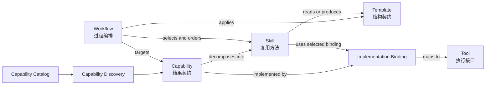

# Capability Model

Capability Model 定义 Game Planner AI Workspace 如何从“策划结果”分解到“可复用方法与执行接口”。本阶段只建立概念模型，不实现注册器、调度器或运行时。

## 六层定义

| 概念 | 回答的问题 | 定义 | 不是什么 |
| --- | --- | --- | --- |
| Capability | 能完成什么？ | 面向游戏策划结果或其共享基础设施支撑结果的稳定能力契约 | 具体脚本、单次提示词或工具品牌 |
| Skill | 如何复用方法？ | 可独立审阅、验证和版本化的方法单元 | 跨步骤项目计划或无边界知识集合 |
| Workflow | 如何协同完成？ | 将 Agent、Skill、Template、Tool 按顺序和关卡编排 | 单个 Skill 或执行工具 |
| Template | 输入输出长什么样？ | Context、分析表、报告、决策记录等结构契约 | 执行逻辑或 Capability 本身 |
| Implementation Binding | 当前由什么实现？ | 将 Capability Operation 映射到 provider、Tool 与 Host 约束 | 稳定结果契约或运行时工具目录 |
| Tool | 通过什么执行？ | 由当前 Host 或外部系统提供的计算、查询、文档或版本系统受控接口 | 策划判断、可交付结果或 Workspace 内置入口 |

## 关系

关系规则：

1. Agent 必须先从 User Outcome 发现 Capability，再选择 Workflow、Skill 和 Implementation Binding；不得从 Tool 名称反推 Capability。
2. 一个 Capability 可以由多个 Skill 共同实现，同一 Skill 也可以支持多个 Capability。
3. Workflow 面向具体目标和项目情境选择 Capability 与 Skill；它负责顺序、责任、审阅关卡、失败处理和交接。
4. Template 约束信息结构，不负责执行；Skill 或 Workflow 可以读取和产出 Template 实例。
5. Implementation Binding 可以随 Host、provider 或版本变化；只要 Capability 的输入、输出、安全和验证契约不变，上层 Workflow 不应变化。
6. Tool 只属于实现层。Tool 可见不等于 Capability 已登记或已获授权；Tool 不可见也不等于 Capability 不存在。
7. Agent 通过 Workflow 获得任务，通过角色所有权和权限规则使用 Implementation Binding 与 Tool。

## Capability 类型

- Planner Capability：直接交付游戏分析、系统/数值设计、活动设计或策划报告结果。
- Platform Capability：为 Planner Capability 提供文档、数据、同步、安全或运行支撑。平台可以由公司多个使用方共享，但 AI-Workspace 只治理其 Game Design 使用契约。

[`Document Capability`](../capabilities/document/README.md) 是共享 Platform Capability。Document Assistant 是当前实现 provider，Feishu MCP tools 是具体 Implementation Binding。AI-Workspace 只消费并约束该 Capability 在 Game Design 中的使用，不能把其他业务项目、正文或 Memory 引入本 Workspace。

## 游戏策划示例（仅模型）

以“评估 Battle Pass 经济设计”为例：

- Capability：评估一套 Battle Pass 是否满足成长、付费与奖励目标。
- Skills：Battle Pass、Economy Design、Excel、SQL、Report Writing。
- Workflow：收集 Context → 验证数据 → 建模 → 评审假设 → 形成报告 → 更新 Status。
- Templates：项目 Context、分析记录、策划报告、决策记录。
- Implementation Bindings：当前 Host 上批准的 Excel、SQL、Python 与 Document provider。
- Tools：由上述 Binding 实际暴露的计算、查询和文档接口。

该示例只说明对象如何组合，不表示相关 Skill、连接器或自动化已经实现。

## 设计检查

新增模型项时应先回答：

- 它交付的是结果、方法、过程、结构还是执行接口？
- 是否属于 Game Design 默认领域？
- 是否有明确输入、输出、安全边界和验证方式？
- 是否与现有 Capability 或 Skill 重复？
- Catalog 中是否存在稳定 ID、Operation class 和成功证据？
- 当前实现状态是 Available、Unavailable 还是未经验证？
- Tool 被替换后，上层契约是否仍然成立？
