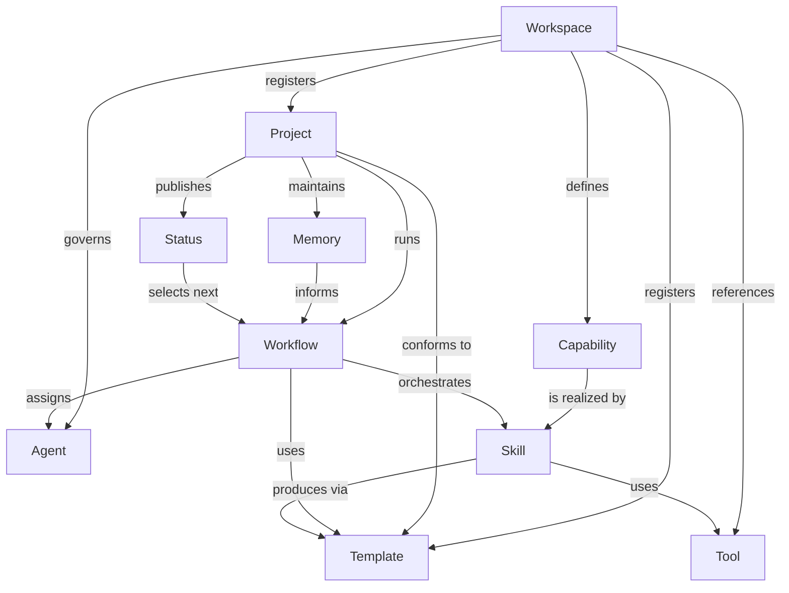

# Workspace Kernel

Workspace Kernel 是 Game Planner AI Workspace 的最小稳定对象模型。它定义游戏策划协作中的对象、职责和关系，不规定运行时、数据库、API 或具体实现。

## 核心对象

| 对象 | 定义 | 主要职责 |
| --- | --- | --- |
| Workspace | 游戏策划 AI 工作台的顶层治理边界 | 维护领域、标准、对象注册、Agent 与服务引用 |
| Project | 一个边界明确的游戏、模块或策划课题 | 组织 Context、Memory、Workflow、Status、Reports、Assets |
| Capability | Workspace 能向策划交付的稳定结果 | 描述“能够完成什么”，不绑定实现方式 |
| Skill | 可复用、边界清晰的方法单元 | 描述触发条件、输入、步骤、输出、安全和验证 |
| Workflow | 为目标编排对象的过程 | 连接 Project、Agent、Skill、Template 与 Tool，并定义关卡和失败处理 |
| Template | 输入、过程记录或输出的结构契约 | 保证同类项目和报告结构一致、可审阅、可复用 |
| Tool | 执行计算、读写或集成的外部接口 | 提供 Excel、SQL、Python、Feishu、Git 等执行能力 |
| Agent | 受角色、权限和所有权约束的协作者 | 进行设计、实施、审阅、验证与交接 |
| Memory | 项目长期有效且经过分类的知识 | 保存 Confirmed、Hypothesis、Decision 及其证据引用 |
| Status | 项目当前可执行状态的快照 | 记录阶段、Owner、证据、风险、阻塞和唯一下一动作 |

## 关系模型

## Kernel 约束

1. Workspace 的默认领域是 Game Design；领域外对象不得进入默认模型。
2. Capability 描述结果，Skill 描述方法，Workflow 描述编排，Tool 描述执行接口，四者不得混用。
3. Project 必须以 `projects/TEMPLATE/` 为结构基线，但不得把业务代码或敏感数据复制进 Workspace。
4. Memory 必须区分 Confirmed、Hypothesis 与 Decision；Status 只保存当前事实和下一动作。
5. Agent 的权限来自角色规则和 User 授权，不因 Tool 可用而自动扩大。
6. 本文是信息模型，不代表已存在任何运行时、自动发现、校验或执行程序。

## Manifest 映射

`workspace.yaml.example` 只为 Workspace、Repository、Project、Agent 与 Service 提供声明示例。它是未来实现可依赖的规范输入，不是当前可执行配置。
