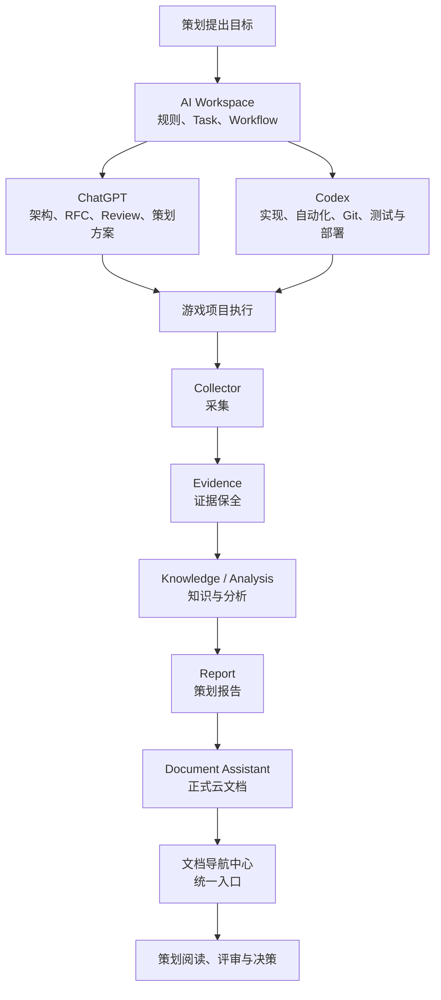

# Game Planner AI Workspace｜项目全景说明

> Git 源稿：`docs/overview/AI_WORKSPACE_PROJECT_OVERVIEW.md`
> 核验基线：`AI-Workspace main@c74c85a9524d1524ea3696835509de2a55e9f524`
> 更新时间：2026-08-29
> 维护说明：本文只维护长期定位、架构与边界；任务、能力成熟度和阻塞统一在《项目进度与能力状态》更新。正式飞书链接由 Document Assistant 在发布时绑定，不写入公共 Git 源稿。

## 一页式项目说明

Game Planner AI Workspace 是面向游戏策划团队的长期 AI 工作台。它不是一个包办所有实现的大型代码库，而是一套把“需求、证据、分析、实现、审阅、交付和长期记忆”连成可审计闭环的协作控制面。

它服务玩法、数值、系统、活动策划和数据分析人员，核心价值是：

- 把跨对话、跨 Agent、跨项目的关键决定从聊天中解放出来，落到可追溯的真相源。
- 先发现需要交付的 Capability，再复用 Workflow、Skill、Template 和已批准实现，减少重复开发。
- 让采集证据、业务分析、报告生成和在线文档各层解耦，每层都可替换、可验证、可回滚。
- 把专业技术复杂度留给工具和 AI，把策划主流程收敛为一键安装、一键启动、一键检查和可理解的成功信号。

本项目的立项原因是“基于现有项目记录归纳”，不冒充 User 的逐字原话或未记录的历史决策过程。

## 📚 下一步推荐阅读

如果希望继续了解 AI Workspace，请从《AI Workspace｜文档导航中心》开始。

文档导航中心收录了目前所有正式文档，包括项目介绍、部署手册、游戏研究、报告、工具说明、知识库等内容。

> 飞书发布版在这里绑定唯一《AI Workspace｜文档导航中心》的可点击链接；公共 Git 源稿不保存租户文档地址。

如果希望查看当前正在推进、后续大概率建设和长期设想，请继续阅读《AI Workspace｜产品路线图（Product Roadmap）》。飞书发布版在这里绑定唯一 Product Roadmap 的可点击链接；公共 Git 源稿不保存租户文档地址。

## 🗺 项目工作流总览

下面这张图从策划视角展示：一个需求如何经过 Workspace 治理、AI 协作、游戏证据采集与分析，最终沉淀为可阅读、可评审的正式文档。



## 为什么要立项

游戏研究与策划工作往往横跨多次对话、多个 AI、多个业务仓库和多种交付平台。如果只依赖聊天、个人记忆或分散脚本，会反复出现以下问题：

1. **长期上下文丢失**：新对话不知道当前 Task、已做决定或唯一下一步。
2. **重复开发**：在本地、团队仓库、公司 SVN、官方方案或成熟开源已有能力时，仍从零实现。
3. **工具与能力混淆**：因为看到某个 Tool 就反推需求，或因某个 Host 没有 Tool 就误判能力不存在。
4. **研究证据不可追溯**：Schema、配置、运行观测、UI 和人工记录被混成同一层“事实”。
5. **报告与实现脱节**：报告没有固定输入、口径、证据和源 commit，上线文档容易与 Git 状态漂移。
6. **策划部署门槛过高**：要求策划理解 Git、ADB、Frida、Proto、权限或令牌，会让真正的研究目标被环境操作淹没。
7. **并行协作冲突**：多个 Task 共用同一工作区或多个 Agent 同时写入，容易覆盖尚未提交的成果。

## 项目目标与非目标

### 目标

- 建立 Game Design 领域内统一、可审阅的 Workspace Kernel 和项目控制面。
- 以 Capability-first 将策划结果与特定 Provider/Tool 解耦。
- 将 Collector、Evidence、Knowledge/Analysis、Report 和 Document 组成可复用、可替换的能力链。
- 以 Git、业务仓库和受控系统保留可审计真相，以飞书和 SVN 提供面向人的协作和发布入口。
- 为多项目、多游戏、多实例和多账号研究提供可扩展但默认隔离的框架。

### 非目标

- 不把 AI-Workspace 建成通用 Agent 平台或非游戏领域知识库。
- 不把所有业务代码、运行数据、安装器、endpoint 或凭据搬进治理仓库。
- 不用 AI 输出替代 User 的产品决策、付费授权、外部发布和不可逆操作。
- 不把聊天、模型记忆、目录存在或 Roadmap 当成能力已经可用的证据。

## 目标用户与典型场景

| 角色 | 典型问题 | Workspace 提供的稳定支撑 |
| --- | --- | --- |
| 玩法策划 | 核心循环、玩法结构、竞品差异如何验证 | 可追溯证据、研究 Workflow、结构化报告 |
| 数值策划 | 概率、产消、成长、定价与返还如何建模 | 数据口径、可复现计算、不确定性与证据分级 |
| 系统策划 | 任务、经济、进度、奖励状态如何组织 | Capability/Skill/Workflow 复用与状态机分析 |
| 活动策划 | 活动节奏、目标、付费加速与追赶机制如何评估 | 时间线证据、数值拆解、风险与决策建议 |
| 数据分析 | 多来源数据怎样保持口径和复查性 | 原始证据留存、脱敏事实层、统计与报告分层 |

## 能力蓝图

能力蓝图描述 Workspace 希望稳定交付的结果，不表示每项能力在当前时点都已实现。实时成熟度仅在进度文档维护。

1. **需求与研究任务治理**：把 User 目标固化为有范围、非目标、安全、验收和交接的 Task。
2. **Capability / Skill / Workflow 发现与复用**：先定义结果契约，再组合方法、过程和实现绑定。
3. **游戏证据采集**：在 User 正常操作下被动保留网络、序列化或本地状态证据，不修改请求、奖励或服务器状态。
4. **Knowledge / Analysis**：将结构、配置、运行观测与人工观察转换为有级别、有限制的知识和分析。
5. **数值与机制拆解**：还原玩家循环、状态、消耗、进度、奖励、概率和不确定性。
6. **AI Report Engine**：从已审阅 Knowledge 与 Template 组装可维护的策划报告内容，不与 Collector 绑死。
7. **AI Document Assistant**：发现、读取、创建、更新、组织和授权公司文档，以回读证明交付。
8. **Task / Review / Handoff**：使目标、实施证据、审阅决定和唯一下一步可由下一个 Agent 直接继续。
9. **Git-backed Memory 与跨对话上下文**：将长期有效内容转为可路由、可 Review、可撤销的 Candidate，不保存完整聊天。
10. **策划面向的安装、启动、检查和交付**：将底层技术收敛为少量清晰入口与成功信号。
11. **多项目、多游戏和多实例扩展**：复用治理层和通用收集生命周期，为每个游戏保留独立 Adapter、仓库和数据边界。

## 总体架构

```text
Global Codex Layer
  Capability Discovery / 共享安全基线 / 保守 Subagent 规则
                         ↓
Governance Plane — AI-Workspace
  Charter / Capability Catalog / RFC / ADR / Standard / Task / Project / Handoff
                         ↓
Execution Plane — 业务仓库与受控系统
  Collector / Analysis / Tests / Release / Document Provider / 项目专属配置
                         ↓
Evidence Plane
  Test / Runtime observation / Release / Commit / Sanitized artifact reference
```

- **Global Codex Layer** 提供跨项目稳定规则，但不保存项目实时状态。
- **AI-Workspace** 是 Game Design 协作与治理真相源，不复制业务实现。
- **业务仓库** 保存代码、测试、运行证据和发布状态；每个项目可有独立仓库。
- **飞书** 是面向人的正式阅读与协作层，不替代 Git 或业务仓库。
- **公司 SVN** 用于策划正式包和公司资源分发；只同步审阅过的安全白名单。
- **本机受控环境** 保存 Secret、私有 Registry、Raw Capture、账号数据和机器专属状态。

## 核心能力链路

```text
Collector → Evidence → Knowledge / Analysis → AI Report Engine → AI Document Assistant
```

| 层 | 职责 | 与其他层的边界 |
| --- | --- | --- |
| Collector | 广泛、无损地保留可重解释证据 | 不预先硬编码最终策划结论 |
| Evidence | 保留版本、时间、位置、方向、谱系与局限 | 不把字段名或单次观测扩展成普遍规则 |
| Knowledge / Analysis | 建立事实层、口径、模型、不确定性与策划解读 | 不承担云文档权限和运输 |
| AI Report Engine | 根据已审阅知识和 Template 组装报告内容 | 不直连 Raw，不与某个文档平台绑定 |
| AI Document Assistant | 搜索防重、创建/更新、结构转换、回读与权限验收 | 不负责推导游戏业务结论 |

这种分层使采集器可以服务多种后续分析，分析可以使用不同报告模板，报告又可以交付到不同受控文档 Provider，而不必重写整条链。

## 设计框架与核心逻辑

1. **Capability-first**：先识别用户结果、对象、操作等级和成功证据，再选实现。
2. **Reuse-first / Build-last**：按顺序检查项目现有脚本、本机工具、团队仓库、SVN、官方方案和成熟开源；只在不适配时自研。
3. **Provider-neutral contract**：Capability 定义稳定输入、输出、安全和验收，Provider/Tool 可替换。
4. **Implementation Binding**：Capability 选定后，再把 Operation 绑定到当前 Host 上的批准实现。
5. **证据驱动**：“已完成”需要 commit、test、release、runtime observation、healthcheck 或回读，不依赖声明。
6. **最小权限**：Tool 可见不代表获得授权；外部写入、付费、权限扩大和不可逆操作必须在 User 授权内。
7. **先读后写、先搜索后创建**：修改前读真相源，云文档创建前搜索防重。
8. **可回滚**：配置修复、文档替换和自动记忆写入都要有备份、冲突检查或事务边界。
9. **可交接**：每个实质 Task 留下目标、证据、变更、阻塞和唯一下一步，不依赖聊天摘要。
10. **单写入者**：同一工作区只有主 Agent 修改文件、Git 和外部系统；并行 Task 使用独立 branch/worktree。

## 核心对象关系

| 对象 | 回答的问题 | 稳定职责 |
| --- | --- | --- |
| Capability | 能交付什么 | 结果契约、操作等级、安全与成功证据 |
| Skill | 如何复用方法 | 触发、输入、步骤、输出与验证 |
| Workflow | 如何协同完成 | 顺序、责任、检查点、失败处理与交接 |
| Tool / Provider | 当前通过什么执行 | 在 Host 上提供受控实现，不取代 Capability |
| Template | 信息长什么样 | 约束 Context、分析、报告、决策和交接结构 |
| Task | 这次要做什么 | 范围、验收、授权、安全和交付边界 |
| RFC / ADR | 提案与长期决策是什么 | RFC 容纳待审设计；ADR 保存已采纳的单项长期决定 |
| Review | 实现是否满足意图 | 给出 Accepted 或 Changes Requested，不以实现者自评代替 |
| Handoff | 下一个协作者如何继续 | 当前结论、证据、风险和唯一下一步 |
| Memory | 什么值得跨对话保留 | 长期有效的事实、决定、规则与 Solution，带来源和路由 |
| Project Control Plane | 某个游戏项目如何被管理 | Context、Memory、Workflow、Status、Reports 和 Assets |

## 角色分工与写入边界

- **User**：决定产品目标、优先级、风险偏好、付费/资源消耗、外部权限和最终验收。
- **ChatGPT**：主责 Architecture、RFC、Review、Workflow 和 Skill 设计，审查意图、证据与领域一致性。
- **Codex**：主责 Implementation、Automation、Git、Testing 和 Deployment，是默认单写入者与实现证据维护者。
- **只读 Subagent**：只在权限受限、任务适合并行且 User/策略允许时，承担仓库探索、资料检索、证据核验或 Review；不修改 Git、配置、飞书或业务系统。
- **其他 AI**：可按同一 Capability、证据、安全与交接规则执行；无写入能力时交付结构化 Outbox/Handoff，不伪称已提交。

## Huuuge：首个业务落地案例

Huuuge Android Research 用于验证“治理控制面 + 业务实现仓库 + 被动证据采集 + 策划发布”的完整形态。其研究导航优先级为：

```text
Slots → Systems → Events → Others
```

- **Slots**：机台、Spin、倍数、Feature、Free Spin、Jackpot 和相关数学/体验问题。
- **Systems**：经济、任务、成长、VIP、奖励、大厅与社交系统。
- **Events**：Lottery、Pass、Collection、Race、Tournament 等运营活动与进度奖励。
- **Others**：Offer、Purchase、传统牌桌/小玩法、平台运行和尚未归类协议族。

这一分类用于策划导航，不强行等同于协议所有权或代码模块边界。后续游戏可复用 Bootstrap、Session、Manifest、Raw 保全、Inventory、Catalog 和隐私原则，但协议 Decoder、Hook Target、Schema Mapping 与模块分类仍需专属 Adapter。

## 研究与证据原则

### L0–L4

| Level | 含义 | 能支持的表达 |
| --- | --- | --- |
| L0 Unverified | 只有线索或未复核观察 | “存在待验证线索” |
| L1 Schema | 可定位的结构、消息、字段或接口 | “该版本存在此结构” |
| L2 Configured / Visible | 配置、可见或间接运行证据 | “在所记录上下文中已配置/可见” |
| L3 Runtime Observed | 脱敏、可解码、可关联 primary action 的直接运行证据 | “该行为在所记录样本中真实出现” |
| L4 Triangulated | Runtime、UI、Manual 时间线与 Schema/Config 多源一致 | “在声明的版本和样本边界内完成多源验证” |

### 证据类型和结论标签

- Schema 证明结构存在；Config 证明特定上下文的配置/可见；Runtime 证明直接观测；UI 和 Manual 用于产品含义与时间线复核。
- **Confirmed** 由可复查证据直接支持；**Estimate** 是有输入和假设的估计；**Hypothesis** 待验证；**Decision proposal** 是供 User 决策的建议。
- 字段存在不等于当前有值，单次结果不等于稳定概率，模块等级不能借给其中每条 claim。

## 多实例与多账号策略

1. 每个模拟器实例/账号使用独立数据库与 Session 命名空间。
2. 每条记录保留脱敏的 `instance_id`、`account_alias`、`session_id`、`game_version`、`schema_version`、`capture_time`。
3. 先对单账号做完整分析，明确该账号、活动阶段、版本和样本边界。
4. 只有在字段和统计口径统一后，才通过脱敏聚合层进行跨账号对比、分群和规律归纳。
5. Raw 数据不跨账号直接混合，不进入公共 Git、飞书或聊天。

## 策划体验标准

| 环节 | 做什么 | 成功表现 | 失败怎么办 |
| --- | --- | --- | --- |
| 一键安装/更新 | 从批准的 Git/SVN 入口获取白名单包，运行预检 | 来源、版本、依赖与安全边界可见 | 在前几分钟 fail-fast，只给出一个精确下一步，不覆盖本机改动 |
| 一键启动 | 于独立研究实例启动必要服务与被动采集 | 明确显示 `READY`、目标实例、输出路径和真实数据写入 | 不杀其他项目进程；保留日志类型与可恢复操作 |
| 一键检查 | 核对环境、版本、权限、服务、证据和输出 | 每个检查项有 pass/fail 和最少、脱敏证据 | 失败在写入前停止；需要账号、系统或管理员授权时交给 User |
| 一键停止/交付 | Clean Finalize，生成清单、脱敏事实和交接 | Session 状态完整，产物可复查，Raw 留本机 | 不直接杀进程、不上传 Raw；记录未完成步骤和唯一恢复动作 |

## 真相源与文档生命周期

| 内容 | 真相源 | 面向人的展示/分发 |
| --- | --- | --- |
| 治理、Capability、RFC/ADR、Task、Review、Handoff | AI-Workspace | 飞书稳定说明与状态快照 |
| 业务代码、测试、分析、运行证据 | 对应业务仓库 | 已审阅报告或脱敏引用 |
| 正式策划包 | 业务 Git + 公司 SVN 修订版 | SVN 下载、部署手册 |
| 公司协作文档 | Git 源稿 + Document Provider 回读 | 飞书原生文档与权限 |
| Secret、凭据、私有 Registry、Raw、账号数据 | 本机/受控存储 | 不进入 Git、SVN、飞书或聊天 |
| ChatGPT Project Sources / Host Memory | 召回与上下文快照 | 不作实时状态或 Review 证据 |

文档从真相源开始，经过核验和脱敏进入 Git 源稿，再由批准的 Document Provider 搜索防重、创建或替换、回读和验权。飞书编辑不应静默反向覆盖 Git；需要回流的修订应先经 Review 回到真相源。

## 安全与授权边界

- Secret、Token、私钥、Authorization Header、账号信息、完整响应、逐笔余额、Raw Capture、APK/二进制和私有 Registry 不进入 Git、飞书或聊天。
- 游戏研究保持被动：不伪造/重放请求，不修改奖励、余额、内存状态或服务器状态，不绕过付费。
- 账号登录、付费、充值、资源消耗、外部发布、权限扩大和不可逆操作由 User 决定或单独授权。
- 新建公司文档默认企业内获得链接的人可编辑；管理员策略拒绝时保留已创建文档，不通过重复创建绕过。
- 私有项目 Memory 只能在 Host-local Registry 明确批准 writer、分类、scope、sensitivity 和目标仓库时写入；未授权则进入脱敏 Outbox。
- 新模拟器实例、Root/Instrumentation、安全策略和共用 Host 修改都需先说明影响、备份和恢复方法。

## 长期演进方向

- 将策划结果契约从少量共享平台能力扩展到更多 Game Design Capability，同时保持 Provider-neutral。
- 将 Skill Tree 从分类模型演进为有输入、步骤、安全、输出和回归证据的方法单元。
- 将被动 Collector 的通用生命周期与游戏专属 Adapter 分离，支持多游戏探索。
- 建立可复现的脱敏事实层和 AI Report Engine，让报告基于口径和证据生成。
- 建立带白名单、冲突检测和 Review gate 的 Git → Feishu / SVN 同步，避免展示层漂移。
- 通过独立数据库与脱敏聚合层支持多实例、多账号和跨游戏比较，不中央化 Raw。
- 持续用真实策划盲测改进一键体验，而不以开发者自测替代用户验收。

## 术语表与入口索引

| 术语 | 简要定义 |
| --- | --- |
| Capability | 面向用户结果的稳定契约 |
| Implementation Binding | Capability Operation 到当前 Provider/Tool 的可替换映射 |
| Skill | 可复用、可审阅的方法单元 |
| Workflow | 编排 Agent、Skill、Template、Tool 和检查点的过程 |
| Evidence | 支持一项精确 claim 的可定位来源与边界 |
| Handoff | 当前状态、证据、风险与唯一下一步的固定交接 |
| Candidate | 尚未获得授权或未进入正式排期的建议方向 |
| Canonical source | 可审计、可回滚、按信息类型确定的真相源 |

核心 Git 入口：

- [AI-Workspace README](https://github.com/840832144/AI-Workspace/blob/070744944d02b8d493c737db74bdc3d404963158/README.md)
- [Architecture](https://github.com/840832144/AI-Workspace/blob/070744944d02b8d493c737db74bdc3d404963158/ARCHITECTURE.md)
- [Workspace Kernel](https://github.com/840832144/AI-Workspace/blob/070744944d02b8d493c737db74bdc3d404963158/docs/architecture/WorkspaceKernel.md)
- [Capability Model](https://github.com/840832144/AI-Workspace/blob/070744944d02b8d493c737db74bdc3d404963158/docs/CapabilityModel.md)
- [Capability Catalog](https://github.com/840832144/AI-Workspace/blob/070744944d02b8d493c737db74bdc3d404963158/capabilities/README.md)
- [AI Team](https://github.com/840832144/AI-Workspace/blob/070744944d02b8d493c737db74bdc3d404963158/AI_TEAM.md)
- 《项目进度与能力状态》（正式飞书链接由文档导航中心提供）
