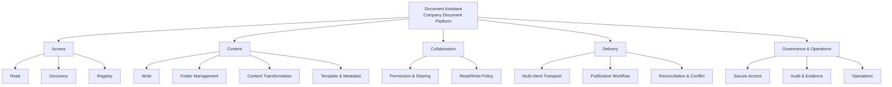

# Document Assistant Capability Roadmap

- Task: TASK-0007
- Status: Waiting for ChatGPT Review
- Date: 2026-08-26
- Owner for architecture/review: ChatGPT
- Owner for future implementation/automation/testing/deployment: Codex
- Related RFC: [`RFC-0002-Document-Assistant.md`](../rfc/RFC-0002-Document-Assistant.md)
- Related ADR: [`ADR-0002-Global-Tool-Discovery.md`](../adr/ADR-0002-Global-Tool-Discovery.md)

## Positioning

**Document Assistant** 保持现有名称，规划为公司的文档能力中台。它向 Agent、Workflow 和业务项目提供统一的文档访问、内容处理、权限、发布和治理能力，而不是某个单一 Agent 的提示词工具。

Document Assistant 是共享基础设施，不改变 AI-Workspace 的 Game Design 业务领域边界。Tool Discovery 与共享入口属于 Global Codex/Host 层；AI-Workspace 只治理它在游戏策划工作中的 Capability、Workflow、权限和交接，不维护安装入口、endpoint、credential 或连接状态。

## Current-state rule

本阶段冻结现有实现：

- 名称仍为 `Document Assistant`，暂不改名。
- 外部 Document Assistant / `feishu-doc-mcp` 仓库继续作为实现真相源。
- 现有 Feishu client、auth、document registry、Markdown converter、MCP tools 和 STDIO 接入不在本任务修改或迁移。
- 现有实现状态必须由外部仓库的 commit、测试和运行证据确认；本 Roadmap 不把“计划能力”写成“已实现”。
- Global AGENTS 模板只定义发现与安全规则，不复制实现，也不把 AI-Workspace 变成工具目录。

## Capability domains

| ID | Capability | Outcome | Current planning state |
| --- | --- | --- | --- |
| DA-CAP-001 | Document Read | 按稳定标识读取文档内容、元数据和结构 | User-confirmed baseline; implementation evidence external |
| DA-CAP-002 | Document Discovery | 搜索文档、列出目录、解析文档/目录关系 | User-confirmed baseline; implementation evidence external |
| DA-CAP-003 | Document Write | 创建、追加、替换和维护文档 | User-confirmed baseline; implementation evidence external |
| DA-CAP-004 | Folder Management | 创建、浏览和维护文档目录 | User-confirmed baseline; implementation evidence external |
| DA-CAP-005 | Content Transformation | 在 Markdown 与平台文档结构之间可靠转换 | User-confirmed baseline; implementation evidence external |
| DA-CAP-006 | Document Registry | 为外部文档、项目和稳定 ID 建立可追踪映射 | User-confirmed baseline; implementation evidence external |
| DA-CAP-007 | Permission & Sharing | 按企业、用户或群组授予允许范围内的访问权限 | Planned; policy and evidence required |
| DA-CAP-008 | Read/Write Policy | 为客户端、Agent 和 Workflow 区分 READ 与 WRITE 能力 | Planned governance contract |
| DA-CAP-009 | Multi-client Transport | 通过复用同一服务层的 transport 服务 Codex、ChatGPT 和未来客户端 | Planned; transport does not duplicate business logic |
| DA-CAP-010 | Secure Access | 客户端身份、服务认证、最小权限和 credential isolation | Planned prerequisite |
| DA-CAP-011 | Publication Workflow | 将已审阅的 Git/Workspace 内容发布或更新到公司文档系统 | Planned; depends on Workspace Sync decisions |
| DA-CAP-012 | Reconciliation & Conflict | 检测来源/目标差异、重复创建、部分成功和冲突 | Planned |
| DA-CAP-013 | Template & Metadata | 统一文档模板、分类、Owner、项目、状态和生命周期元数据 | Planned |
| DA-CAP-014 | Audit & Evidence | 记录调用结果、版本、权限决定和可复查证据，不记录 secret/正文 | Planned prerequisite |
| DA-CAP-015 | Operations | 健康检查、监控、告警、恢复、兼容性和发布治理 | Planned |

这些 ID 是 Roadmap 的稳定讨论标识，不是 MCP tool name、API path 或已经发布的 contract。

## Capability model

## Roadmap

### Phase 0 — Review and Baseline

状态：**Waiting for ChatGPT Review**

- 审阅公司文档中台定位、Global Tool Discovery 和 Game Design 使用契约边界。
- 对照外部仓库建立 As-Is capability evidence，不修改实现。
- 确认 Capability ID、Owner、READ/WRITE 分类和验收语言。
- 决定 RFC-0002 是否可进入 Accepted，或需要修订。

退出标准：ChatGPT 给出 Accepted / Needs changes；User 对定位和优先级无异议。

### Phase 1 — Governance Contract

状态：Planned

- 定义统一文档标识、Document/Folder/Principal/Permission/Revision 等概念模型。
- 定义 READ、WRITE、ADMIN/SECURITY 操作等级及默认授权规则。
- 定义幂等、部分成功、重试、冲突和错误语义。
- 定义 credential、日志、正文、审计证据和数据保留边界。
- 为每项 Capability 写明输入、输出、权限、副作用和验收证据。
- 详细平台契约归外部 Document Assistant 项目；AI-Workspace 只保留 Game Design 消费侧约束。

退出标准：接口和安全 contract 经过 ChatGPT Review 与 User 决策；仍不要求实现。

### Phase 2 — Core Document Platform

状态：Planned

- 以现有 Feishu client、auth、registry、converter 和 tools 为单一实现基线。
- 验证 Read、Discovery、Write、Folder、Transformation、Registry 的一致契约。
- 建立 template/metadata 模型，但不把公司文档正文复制到 AI-Workspace。
- 明确平台限制、配额、格式损失和兼容策略。

退出标准：核心 Capability 有外部仓库证据、测试边界和版本策略。

### Phase 3 — Permission and Secure Multi-client Access

状态：Planned

- 定义企业、用户、群组 Principal 与平台 permission 的映射。
- 只在企业管理员策略允许时授予共享权限；任何 API 都不得绕过组织策略。
- 定义 Codex STDIO 与 ChatGPT Remote MCP 的统一服务层和独立 transport/auth 边界。
- 确认 ChatGPT 当前客户端能力限制与未来 WRITE 开放之间的兼容策略。
- 建立最小权限、认证失败、撤销、轮换和审计要求。

退出标准：安全模型先通过 Review，之后才能授权实现或部署。

### Phase 4 — Company Publication and Sync

状态：Future

- 建立 Git/Workspace → Feishu 的审阅后发布流程。
- 定义 source of truth、revision mapping、diff、冲突、重复文档和部分失败处理。
- 支持模板化策划报告、RFC、ADR、状态和交接发布。
- 与 Workspace Sync Phase 3 对齐，但保持 Document Assistant 实现仓库独立。

退出标准：一次发布可追踪来源 commit、目标 revision、权限结果和审阅记录。

### Phase 5 — Operations and Platform Governance

状态：Future

- 定义 health、SLO、metrics、alerts、rate limit 和 dependency status。
- 定义 schema/tool compatibility、deprecation、rollback 和 release channels。
- 定义备份/恢复、灾难演练和 Registry 修复流程。
- 建立公司级 Capability catalog 和使用方登记，但不在本阶段建设通用业务 Workspace。

退出标准：平台可被多个受控客户端长期使用、审计和恢复。

## Review questions

ChatGPT Review 需要明确回答：

1. “公司文档中台”定位是否与 Game Planner AI Workspace 的基础设施边界兼容？
2. Capability domains 是否遗漏关键结果或把 Tool/Workflow 误写成 Capability？
3. READ / WRITE / ADMIN-SECURITY 是否应作为三层，而不是两层权限模型？
4. Registry、Revision 和 Publication 的真相源应如何分工？
5. Roadmap 是否仍有任何内容会让 AI-Workspace 误承担运行时工具入口职责？

## Non-goals

- 本任务不修改 Document Assistant、`feishu-doc-mcp` 或任何 MCP 配置。
- 本任务不改名、不迁移仓库、不新增 transport、不建立 tunnel、不调用 Feishu API。
- 本任务不改变 ChatGPT 设置，不实现权限 API、同步、监控或部署。
- 本任务不把公司文档正文、credential、token 或私有 Registry 写入 AI-Workspace。
- 本任务不在 AI-Workspace 建立 MCP/Connector/Plugin 的运行时目录、安装入口、endpoint 或连接状态表。
