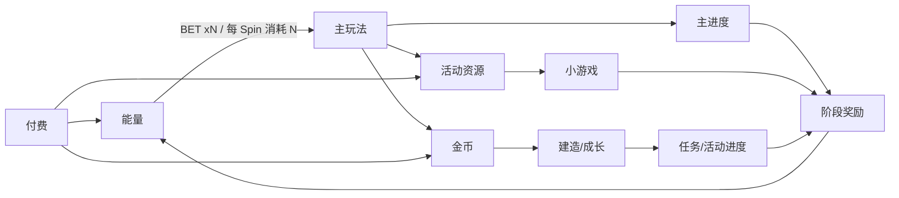

# [竞品名] 数值拆解报告

> 结论状态：本轮完成 [P0–P6 哪些阶段]，其余待补。
> 版本：[v0.1]（[日期]）。原始素材：[文件清单/来源]。
> 原则：事实与假设分开；观察频率不是服务端真值；未知口径标"待确认"。

## 0. 报告信息

| 项目 | 内容 |
|---|---|
| 报告名称 | 《[竞品名] 数值拆解报告》 |
| 分析日期 |  |
| 原始素材 |  |
| 总时长 / 帧数 |  |
| 样本口径 | 账号阶段 / 付费状态 / BET / 成长段 |
| 明确排除 |  |

## 1. 核心结论先行

| 维度 | 结论 | 状态（已确认/方向性/不可识别） |
|---|---|---|
|  |  |  |

## 1.5 体验总览（节点进度快照）

| 节点 | 日/时间 | 阶段 | 累计消耗(口径) | 等级 | 已解锁BET | 金币余额 | 能量 | 建造任务 | 主进度 | 区域 | 小游戏/活动 | 任务/Pass | 累计付费 | 波动事件 |
|---|---|---|---|---|---|---|---|---|---|---|---|---|---|
|  |  |  |  |  |  |  |  |  |  |  |  |  |  |  |

| 等级门槛 | 解锁内容（BET / 系统 / 建造区域） | 证据分级 |
|---|---|---|
|  |  |  |

## 2. 全局资源循环



| 层 | 源(Source) | 汇(Sink) | 回流 | 层内净产出 |
|---|---|---|---|---|
| 操作层 |  |  |  |  |
| 会话层 |  |  |  |  |
| 日层 |  |  |  |  |
| 周·活动层 |  |  |  |  |
| 长周期层 |  |  |  |  |

## 3. 主玩法拆解（BET 档位）

| 档位 | 每Spin消耗 | 解锁条件 | 样本n | 金币命中率 | 返还均值/P50/P90 | 能量自返还率 | 波动特征 | 结论 |
|---|---:|---|---:|---|---|---|---|---|

结果树概率表：

| 结果主类 | 样本n | 观察频率 | 95% Wilson 区间 | 单次返还均值/P50 | 说明 |
|---|---:|---:|---:|---|---|

档位切换策略：[新手激进期 / 持金比例 / 解锁限制]

## 4. 成长/建造循环

- 成本曲线：[任务/地块价格 vs 序号；拟合形式]
- 目标曲线：[主进度目标 vs 成长段；节点奖励 vs 目标值]
- 完成周期：[里程碑所需 Spin/天，0 付费与付费口径]
- 启动资金来源：
- 首次"金币不足"：第 [N] 次操作
- 枯竭频率：

## 5. 小游戏与活动模块

| 模块 | 入场资源 | 单局消耗 | 规则与结构 | 返还分布 | 期望值 | 经济占比 |
|---|---|---|---|---|---|---|

## 6. 任务/Pass/免费/日历

- 任务图谱：
- Pass：
- 免费/日历：

## 7. 付费体系拆解

| 商品 | 价格 | 标称价值 | 到账口径 | 实际到账 | 触发时机 | 是否购买 |
|---|---|---:|---|---|---|---|

- 价格阶梯与每 USD 资源：
- 付费深度（累计付费 → 可玩时长/进度）：
- 首次付费压力点（弹窗/破产区分）：

## 8. 体验模拟与波动体验曲线

### 8.1 输入参数

| 参数 | 值 | 状态 |
|---|---|---|
| 玩家画像 |  |  |
| 初始资源 |  |  |
| 汇率锚点 |  |  |
| 模拟周期 |  |  |
| BET 策略 |  |  |
| 模块 RTP |  |  |
| 结果树分布 |  |  |
| 建造成本曲线 |  |  |
| 付费注入 |  |  |

### 8.2 指标表

| 指标 | $0 | $[档] | $[档] | … |
|---|---:|---:|---:|---:|
| 期末余额（P50） |  |  |  |  |
| 最大回撤 |  |  |  |  |
| 谷值次数 |  |  |  |  |
| 破产事件 |  |  |  |  |
| 建造任务数 |  |  |  |  |
| 达到下一付费点时间 |  |  |  |  |
| 每 USD 可玩时长 |  |  |  |  |

### 8.3 图表

1. 余额轨迹叠加图（付费点标红）。
2. 分位数带图（P10/P50/P90）。
3. 连输长度与最大回撤分布。
4. 建造完成进度 vs 时间。

## 9. 长周期与大 R

- 毕业成本：
- 全收集：
- 大 R 上限与内容耗尽点：

## 10. 风险、待确认与补采

| 缺口 | 对结论的影响 | 补采通过条件 |
|---|---|---|

## 11. 复算命令

```powershell
python .\数值策划\工具\simulate_[game]_experience.py --input <json> --output <json>
python .\数值策划\工具\generate_[game]_report.py --input <json> --md <md> --html <html>
```

随机种子：`[固定值]`；输入、假设、逐操作流水与余额均保存在 JSON 与工作簿中。
