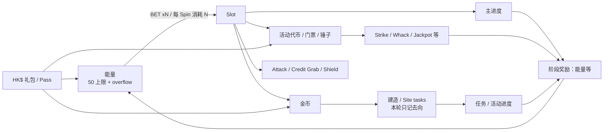

# Top Tycoon 录屏数值拆解报告

> 结论状态：本轮完成 P0–P4 的证据化拆解与 P5 的小样本方向性模拟；P6 付费前后对比因素材缺失不可识别。所有概率均为录屏观察频率，不是服务端配置真值。

## 0. 报告信息

| 项目 | 内容 |
|---|---|
| 报告名称 | 《Top Tycoon 录屏数值拆解报告》 |
| 分析日期 | 2026-08-04 |
| 原始素材 | `1.mp4`–`6.mp4`，共 6 段 |
| 总时长 | 11,226.43 秒，约 3:07:06 |
| 固定证据帧 | 11,229 张，原分辨率 720×1280，1 fps |
| Spin 试标 | 140 个事件行 / 142 个推算 Spin |
| 概率方向性样本 | 136 个 A/B 级、单事件对应单 Spin 的样本 |
| 明确排除 | 建造金币成本曲线、服务端真值、Cash Royal 配置建议 |

## 1. 核心结论先行

| 维度 | 结论 | 状态 |
|---|---|---|
| Slot 消耗 | `BET xN` 对应每 Spin 消耗 `N` 能量；本轮看到 x1、x2、x5、x10、x20、x100、x200 展示 | 已确认 |
| 能量口径 | 主能量条上限为 `50/50`，额外能量以 `+N` overflow 展示；顶部绿色大数不是 Spin 能量 | 已确认 |
| 试标质量 | 140 个事件中 136 个达到 A/B 级可解释，闭环率 97.1%，通过 P2 的 95% 门槛 | 已确认 |
| 概率 | 各主要切片只有 3–45 个有效 Spin，远低于每切片 500 的初筛门槛 | 方向性 |
| 主进度 | 可见节点从 `200→400能量`、`540→1.2K能量` 到 `4100→5K能量`，目标与奖励随成长/下注段显著放大 | 已确认；不是同账号曲线 |
| 小游戏 | Strike、Whack a Pig、Jackpot、Friendship Tower、Lead Pursuit、Tycoon/Boxing Pass 均形成 Slot 外层消耗与回流 | 机制已确认；期望值待补 |
| 付费 | 只观察到礼包与通行证展示，没有任何实际购买和购买前后窗口 | 录屏未展示购买 |
| 全局 RTP | 金币和能量没有可靠兑换锚点；小游戏也缺完整局样本，不能计算标准化总 RTP | 不可识别 |

**我的判断：** Top Tycoon 的数值骨架不是单一 Slot RTP，而是“能量下注—Slot 多路产出—主进度/活动门票—小游戏或阶段奖励—能量回流”的多层循环。当前素材足够还原机制、资源口径和若干节点，但不足以回答稳定概率、毕业成本、付费待遇变化或全局总返还。

## 2. 全局资源循环



必须分开的三套口径：

1. 原生单位：金币/能量、进度/能量、门票/能量。
2. 自返还率：直接返还能量 ÷ Spin 能量消耗。
3. 标准化总返还：只有建立可靠金币↔能量锚点后才可计算；本轮不计算。

**我的判断：** 录像中的高额能量返还具有明显离散性，部分切片的观察自返还率甚至超过 100%。这说明当前事件样本受片段选择、里程碑和大额返还影响，不能把它当成总体 RTP；应先补连续、等口径 Spin，再把一次性奖励作为状态节点单独模拟。

## 3. Slot 基础盘


图 1 来源：`TT_NEW_03 00:02:17`。界面同时证明 BET、能量条、主进度与节点奖励的相对位置。

### 3.1 样本质量与分层

| 视频/下注 | 有效单 Spin n | 纯金币观察频率 | 95% Wilson 区间 | 空奖观察频率 | 95% Wilson 区间 |
|---|---:|---:|---:|---:|---:|
| TT_NEW_01 x1 | 44 | 61.4% | 46.6%–74.3% | 4.5% | 1.3%–15.1% |
| TT_NEW_03 x5 | 17 | 47.1% | 26.2%–69.0% | 11.8% | 3.3%–34.3% |
| TT_NEW_03 x10 | 24 | 75.0% | 55.1%–88.0% | 4.2% | 0.7%–20.2% |
| TT_NEW_03 x20 | 3 | 33.3% | 6.1%–79.2% | 0.0% | 0.0%–56.2% |
| TT_NEW_06 x2 | 3 | 33.3% | 6.1%–79.2% | 0.0% | 0.0%–56.2% |
| TT_NEW_06 x5 | 45 | 53.3% | 39.1%–67.1% | 2.2% | 0.4%–11.6% |

结果类型按互斥主类统计：纯金币、混合奖励、Attack、空奖、纯进度、Shield、Credit Grab、大奖。更细的复合资源仍保留在原始 `result_type` 与资源流水中。

公式：

```text
观察概率 = 类型出现数 / 同口径有效 Spin 数
Wilson 95% 区间 = 二项比例 Wilson score interval, z = 1.96
金币命中率 = coin_gain_observed > 0 的 Spin 数 / 有效 Spin 数
```

**我的判断：** 表中差异不能解释为“下注改变概率”。成长段、活动状态、新手强控、会话位置和账号状态没有被控制，而且所有切片均低于 500 Spin。当前唯一可靠结论是结果树存在且每类可被唯一归账；概率差异只作为下一轮采样线索。

### 3.2 奖励与自返还观察

| 切片 | 金币命中率 | 金币/耗能均值 | 金币/耗能 P50 | P90 | 观察能量自返还率 |
|---|---:|---:|---:|---:|---:|
| TT_NEW_01 x1 | 90.9% | 4,042.93 | 1,000 | 10,121.10 | 79.5% |
| TT_NEW_03 x5 | 82.4% | 3,637.81 | 3,000 | 9,028 | 471.8% |
| TT_NEW_03 x10 | 95.8% | 5,482.12 | 1,079.40 | 21,970 | 9.6% |
| TT_NEW_03 x20 | 100.0% | 5,668.33 | 130 | 13,446 | 66.7% |
| TT_NEW_06 x2 | 66.7% | 2,283.33 | 1,850 | 4,370 | 333.3% |
| TT_NEW_06 x5 | 93.3% | 5,685.94 | 1,100 | 10,300 | 506.7% |

`金币/耗能` 保留原生单位，不与能量相加。超过 100% 的观察能量自返还率来自当前样本中的大额、离散回流，不能外推。

## 4. 主进度与阶段奖励

| 证据 | 账号/下注截面 | 当前/目标 | 节点奖励 | 结论 |
|---|---|---:|---:|---|
| TT_NEW_03 00:02:17 | 前期，x5 | 175/200 | 400 能量 | 已确认 |
| TT_NEW_03 00:12:50 | 较后，x10 | 5/540 | 1.2K 能量 | 已确认 |
| TT_NEW_05 00:01:40 | 高成长段，x100 | 2075/4100 | 5K 能量 | 已确认 |


**我的判断：** 三个截面证明目标值与奖励会随账号/成长/下注环境缩放，但它们来自不同时间段和账号，不能直接拟合成连续成长曲线。下一轮必须在同账号内完整记录至少两轮“重置—推进—领奖”，才能计算节点期望能量成本。

## 5. 小游戏与活动模块

### 5.1 Friendship Tower

| 邀请人数 | 1 | 2 | 5 | 8 | 10 | 20 |
|---:|---:|---:|---:|---:|---:|---:|
| 能量奖励 | 40 | 40 | 170 | 210 | 420 | 1,000 |


**我的判断：** 这是完整可见的社交换能量阶梯，但没有成功邀请率、邀请成本和新用户质量，不能把展示奖励直接转成期望能量。

### 5.2 Lead Pursuit

Day 1 可见总目标 3,200；里程碑为 `600→60能量`、`1,200→600K金币`、`1,800→170能量`、`2,400→310能量`、`3,000→Wild`。任务包括 Bonus、Attack、Credit Grab、Spin 和 Site tasks。


另一个视频的 Day 5 同样显示 3,200 总目标，但任务规模已出现 `Attack 160`、`Credit Grab 140`、`Earn 7,200 Bonus pts`、`Complete 80 site tasks`。由于账号和成长段不同，只能确认系统支持任务配额缩放，不能下结论为按日固定增长。

### 5.3 Strike Lucky

- 来源：Slot 产出 Strike 代币。
- 单次消耗：蓝环探索 1 代币。
- 结构：棋盘含金币、能量、卡包、Wild、宝箱；落到 Surprise Box 进入内环。
- 缺口：完整棋盘结算、落点概率、保底与重置规则未覆盖。


### 5.4 Whack a Pig

- 入场资源：锤子；界面持有 5。
- 首层目标：0/1。
- 可见能量档：35、380、1,500。
- 缺口：目标命中概率、TNT 后果、失败保留与毕业成本未展示。


### 5.5 Jackpot 三轨板与 Pass

- Jackpot 三轨：绿/蓝/紫轨单次消耗 2/5/10 门票；首层各需 3 个对应宝石；奖励分别为 60/360/1.3K 能量。
- Tycoon Pass：可见 25/60、Phase 1、节点 4/5、周期 14d18h；当前页未展示完整双轨总奖励和价格。
- Boxing Pass：HK$40，界面标称 `940 TOTAL` 能量，周期 2d12h；未观察购买。


**我的判断：** 小游戏共同承担“把 Slot 的随机图标或代币转化为更长目标链”的作用，但当前只够建立机制字典。要计算期望返还，每个随机小游戏至少需要覆盖 3 个难度段、每段 100 次有效尝试；非随机进度型模块也要覆盖完整进入—游玩—结算。

## 6. 付费展示与分层边界

### 6.1 可见报价

| 视频 | 报价 | 价格 | 可见资源 | 购买状态 |
|---|---|---:|---|---|
| TT_NEW_03 | Chapter Prize | HK$40 | Up to 2.06K 能量 | 未购买 |
| TT_NEW_03 | Mission Pass | HK$55.90 | Up to 4K 能量 | 未购买 |
| TT_NEW_03 | Ads Removal Pack | HK$40 | 130 能量 + 60K 金币 + 去广告 | 未购买 |
| TT_NEW_03 | Champion's Pack | HK$788 | 3.7K 能量 + 1.8M 金币 | 未购买 |
| TT_NEW_03 | Boxing Pass | HK$40 | 标称总计 940 能量 + 分层奖励轨 | 未购买 |
| TT_NEW_05 | Mission Pass | HK$55.90 | Up to 7.1K 能量 | 未购买 |
| TT_NEW_05 | Champion's Pack | HK$788 | 6.6K 能量 + 4.1M 金币 + 100 票券 | 未购买 |


同价 Mission Pass 在两个视频中分别展示 Up to 4K 与 Up to 7.1K 能量；同价 Champion's Pack 也展示不同资源量。可解释项包括成长段缩放、账号权益、活动差异、商店个性化或版本差异，录像没有给出控制变量。

### 6.2 Prize Carnival 顺序礼包

| 步骤 | 价格 | 可见能量 | 金币 | 其他 | 状态 |
|---|---:|---:|---:|---|---|
| Step 1 | HK$40 | 660 | 1.2M | 4 卡包 | 可见可购 |
| Step 2 | HK$40 | 1.4K | 2.6M | 6 卡包 | 锁定 |
| Step 3 | HK$40 | 1.9K | 3.5M | 宝箱 | 锁定 |


**我的判断：** 录像能确认“同价、后步展示资源更高、需要顺序解锁”的包装结构，但没有实际购买，不能判断转化、真实到账、付费总续航或概率待遇变化。P6 必须等同账号购买前后各 100/300 Spin 连续窗口后再做。

## 7. 方向性循环模拟

为避免把观察自返还率超过 100% 的偏置切片套入无穷递归，本轮只对 `TT_NEW_01 x1` 的 44 个新手样本做经验重采样。固定条件：随机种子 20260804、10,000 次试验、初始能量 50、上限 5,000 Spin。

| 情景 | 能量返还调整 | 公式方向性总 Spin | 蒙特卡洛均值 | P10 | P50 | P90 |
|---|---:|---:|---:|---:|---:|---:|
| 下行 | -10% | 176.00 | 172.35 | 63 | 131 | 338 |
| 基准 | 0% | 244.44 | 240.48 | 65 | 155 | 515 |
| 上行 | +10% | 400.00 | 390.37 | 66 | 193 | 919 |

公式：

```text
观察 r = 35 返还能量 / 44 消耗能量 = 79.5%
理论 Spin 倍数 = 1 / (1 - r) = 4.89
方向性总 Spin = 初始能量 / 单 Spin 消耗 × 理论 Spin 倍数
```

**我的判断：** 模型对少数大额能量返还高度敏感，尤其是上行场景的 P90 拉长到 919 Spin。这不是“新手 50 能量一定能玩 240 次”的预测，只是说明：在当前经验分布下，离散回流会显著放大尾部续航，下一轮必须把一次性奖励、活动上限和新手强控从基础盘中剥离。

## 8. 证据状态与不可识别项

| 问题 | 当前状态 | 处理 |
|---|---|---|
| 客户端版本、地区 | 录屏未展示；只见 HK$ 币种 | 保留未知，不把币种当地区 |
| 累计付费档、VIP 因果 | 录屏未展示 | 不做付费分层结论 |
| 不同下注概率是否相同 | 样本不足且状态混杂 | 仅报 Wilson 区间，不做显著性结论 |
| 动态调控 | 未形成匹配切片 | 不标“疑似调控” |
| 小游戏成功率/期望返还 | 完整局不足 | 只登记入口、消耗、可见奖励 |
| 标准化总 RTP | 缺金币↔能量锚点 | 只保留原生单位和能量自返还 |
| 建造成本曲线 | 明确非目标 | 仅记录金币去向 |
| TT_NEW_02 与主循环关系 | 录屏未展示 | 不进入主循环和概率样本 |
| VFR 视频时间轴 | 浏览关键帧标签漂移约 4–7 秒 | 所有核心证据改用固定 1 fps FrameIndex |

## 9. 下一轮最小采样计划

1. 先补齐版本、地区、账号成长段、累计付费/VIP、活动状态。
2. 每个主要“账号段 × BET × 状态”先采 500 个连续有效 Spin；基础盘累计至少 2,000。
3. 对 1% 级稀有结果，目标同口径 10,000 Spin。
4. 小游戏覆盖 3 个难度段；随机成败模块每段至少 100 次完整尝试。
5. 付费分析只采用同账号、同下注、相近成长段的购买前后各 100/300 Spin 窗口。
6. 只有在独立视频复现、控制变量后差异仍稳定时，才升级为“疑似动态调控”。

## 10. 交付物与复算入口

- `Top_Tycoon原始事件账.xlsx`：VideoIndex、FrameIndex、SpinLog、StageLog、PurchaseLog、ResourceLedger、EvidenceIndex。
- `Top_Tycoon数值模型.xlsx`：公式化概率/Wilson、奖励、进度与模块、循环、付费展示、敏感性和缺口。
- `top_tycoon_simulator.py`：固定随机种子复算概率、Wilson、能量续航和 ±10% 敏感性。
- `SpinLog_sample.csv`：模拟器默认输入。
- `关键截图索引.csv`：18 个核心证据点。

## 11. 质量检查

| 检查项 | 结果 |
|---|---|
| 视频帧数与 `floor(duration)+1` 一致 | 是，6/6 |
| P2 A/B 级闭环率 ≥95% | 是，97.1% |
| 概率含 n 与 95% Wilson 区间 | 是 |
| 小样本未包装成精确概率 | 是 |
| 付费展示与实际购买分开 | 是 |
| 金币、能量未强行相加 | 是 |
| 核心结论可回链固定 1 fps 截图 | 是 |
| 建造成本保持在非目标边界 | 是 |

