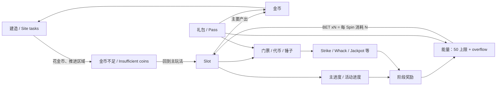

# Top Tycoon 录屏数值拆解报告

> 执行版本：v0.2（2026-08-04）。本报告只使用 `1.mp4`–`6.mp4`。所有概率均为录屏观察频率；建造成本为固定 1 fps 证据上的 10 秒窗口差额；等价美金返还受业务锚点门控。

## 0. 数据边界与完成度

| 项目 | 结果 | 状态 |
|---|---:|---|
| 原始视频 | 6 段 / 11,226.43 秒 | 已确认 |
| 固定 1 fps 帧 | 11,229 / 11,229 | 已确认 |
| SegmentLog | 391 段，六个视频均有模块位置 | 已确认 |
| SpinLog | 140 个事件行 / 142 个推算 Spin | 已确认 |
| 概率方向性样本 | 136 个 A/B 级单 Spin；闭环率 97.1% | 已确认 |
| BuildLog | 48 个金币下降窗口；33 个同时闭合区域进度 | 推算 |
| 实际购买 | 0 | 录屏未展示 |
| 能量/金币 USD 锚点 | 未确认 | 待业务确认 |

本轮通过了“六段视频全部定位”和“Slot、建造至少各有一个可核账窗口”。主进度、小游戏、礼包虽然已定位，但没有完整起止资源快照，因此仍是明确缺口。

## 1. 全局资源循环



核心闭环是：

```text
建造花金币 → 金币不足 → Slot 花能量赚金币 → 金币回流建造
小游戏 / 主进度 / 礼包 → 补充能量、金币或二级资源 → 延长循环
```

必须保留三类独立口径：

1. `Slot 原生返还`：金币/能量、能量/能量、进度/能量。
2. `建造原生效率`：区域进度/金币，或其倒数金币/进度。
3. `等价美金返还`：USD 等价产出 ÷ USD 等价消耗；锚点未确认前不输出确认值。

## 2. 视频切分与有效数据找回

| 模块 | 定位秒数 | 时长占比 | 切分段数 | 可核账窗口 | P0 验收 |
|---|---:|---:|---:|---:|---|
| Slot | 4,780 | 42.6% | 113 | 19 | 通过 |
| 建造 | 3,616 | 32.2% | 105 | 20 | 通过 |
| 主进度 | 80 | 0.7% | 7 | 0 | 缺口 |
| 小游戏 | 1,343 | 12.0% | 70 | 0 | 缺口 |
| 礼包 | 950 | 8.5% | 62 | 0 | 缺口 |
| 转场/加载 | 460 | 4.1% | 34 | 不适用 | 不适用 |

找回方法：固定 1 fps 为主时间轴；已有 4 fps 事件补核继续用于瞬时 Slot 结算；建造采用相邻 10 秒固定帧的金币余额与区域进度差额。浏览关键帧只辅助分类，不作为 VFR 时间证据。

排除原因已经逐段写入 SegmentLog：转场/加载、缺前后快照、能量 overflow 无法逐次闭合、只展示奖励页、实际购买未发生，以及 TT_NEW_02 未展示 Top Tycoon 主资源回流。

## 3. 建造模块

### 3.1 可恢复到什么粒度

BuildLog 的一行代表一个“10 秒建造/Site task 批次”，不是单次点击价格。48 个金币下降窗口中：

- 33 个窗口同时识别到同一目标下的正向区域进度，进入阶段量级曲线。
- 15 个窗口因区域切换、进度回退、OCR 数字格式异常或无法拆分任务组合，只保留在原始账。
- 可用窗口合计消耗 74,983,206 金币、增加 316,800 区域进度；加权为 236.69 金币/进度。这个合计混合账号、区域和 Buff，不能当全局配置。


`TT_NEW_01 00:04:00–00:04:10`：金币 `1,591→1,563`，区域进度 `30,000→31,000/54,000`，窗口总消耗 28 金币。状态为“推算”，不等同单击价。

### 3.2 区域量级

| 区域 | 可用窗口 | 金币总消耗 | 进度总增量 | 加权金币/进度 | 状态 |
|---|---:|---:|---:|---:|---|
| Apex Rush | 1 | 708,149 | 15,000 | 47.21 | 推算 |
| Circus Mirage | 2 | 3,140,811 | 38,000 | 82.65 | 推算 |
| Epic Splash | 1 | 1,102,558 | 18,000 | 61.25 | 推算 |
| Fable Haven | 5 | 2,704,763 | 28,000 | 96.60 | 推算 |
| Natural Gas | 3 | 6,088,003 | 22,000 | 276.73 | 推算 |
| Port | 8 | 21,828,485 | 56,000 | 389.79 | 推算 |
| Sewage Treatment | 2 | 6,223,622 | 26,000 | 239.37 | 推算 |
| Wind Farm | 4 | 22,199,727 | 74,000 | 300.00 | 推算 |

`Emerald Trail`、`Freefall`、`Pixie Hollow`、`Sky Plunge` 也有可用窗口，但样本仅 1–2 个；其中 `Freefall` 属早期低成本段，不与后续区域直接横比。另有无法可靠辨认的区域名仅保留在原始账，不进入区域结论。


### 3.3 解锁、产出与枯竭

- 已确认：建造推进区域进度，并参与 Site tasks / Lead Pursuit 等任务。
- 已确认：界面出现 `Insufficient coins`，说明建造确实是金币枯竭触发点。
- 推算：同一账号的高成长区域，10 秒窗金币消耗可到百万至千万量级。
- 录屏未展示：完整地块/建筑 ID、逐次升级价格、完整前置顺序、单次建造时长、无剪辑的首次枯竭点。

结论：当前可以说“建造是金币主要消耗端，成本量级随区域显著放大”；不能给出服务端单击成本公式或完整章节成本。

## 4. Slot 基础盘


### 4.1 消耗与能量口径

- `BET xN` 对应每 Spin 消耗 `N` 能量。
- 主能量条上限为 `50/50`，额外能量以 `+N` overflow 展示。
- 本轮看到 x1、x2、x5、x10、x20；另有 x100、x200 机制展示，但不进入干净概率分母。

### 4.2 观察概率

| 视频/下注 | 有效 n | 纯金币观察频率 | 95% Wilson 区间 | 空奖观察频率 | 95% Wilson 区间 |
|---|---:|---:|---:|---:|---:|
| TT_NEW_01 x1 | 44 | 61.4% | 46.6%–74.3% | 4.5% | 1.3%–15.1% |
| TT_NEW_03 x5 | 17 | 47.1% | 26.2%–69.0% | 11.8% | 3.3%–34.3% |
| TT_NEW_03 x10 | 24 | 75.0% | 55.1%–88.0% | 4.2% | 0.7%–20.2% |
| TT_NEW_03 x20 | 3 | 33.3% | 6.1%–79.2% | 0.0% | 0.0%–56.2% |
| TT_NEW_06 x2 | 3 | 33.3% | 6.1%–79.2% | 0.0% | 0.0%–56.2% |
| TT_NEW_06 x5 | 45 | 53.3% | 39.1%–67.1% | 2.2% | 0.4%–11.6% |

所有切片均低于 500 Spin 初筛门槛，差异不能解释为下注改变概率；当前只确认结果树和资源归账结构。

### 4.3 原生返还

| 切片 | 金币/耗能均值 | 金币/耗能 P50 | 观察能量自返还率 | 解释 |
|---|---:|---:|---:|---|
| TT_NEW_01 x1 | 4,042.93 | 1,000 | 79.5% | 新手段，方向性 |
| TT_NEW_03 x5 | 3,637.81 | 3,000 | 471.8% | 含离散大额回流 |
| TT_NEW_03 x10 | 5,482.12 | 1,079.40 | 9.6% | 小样本 |
| TT_NEW_03 x20 | 5,668.33 | 130 | 66.7% | n=3 |
| TT_NEW_06 x2 | 2,283.33 | 1,850 | 333.3% | n=3 |
| TT_NEW_06 x5 | 5,685.94 | 1,100 | 506.7% | 含离散大额回流 |

超过 100% 的自返还来自非完整、非等概率抽样中的大额奖励，不能外推总体 RTP。

## 5. 主进度

| 截面 | 当前/目标 | 节点奖励 | 状态 |
|---|---:|---:|---|
| TT_NEW_03 x5 | 175/200 | 400 能量 | 已确认 |
| TT_NEW_03 x10 | 5/540 | 1.2K 能量 | 已确认 |
| TT_NEW_05 x100 | 2075/4100 | 5K 能量 | 已确认 |

这三个截面证明目标和奖励会随账号/成长/下注环境放大，但来自不同视频，不能拟合为同账号连续曲线。主进度仍缺完整“重置—推进—领奖”窗口。

## 6. 小游戏与活动

| 模块 | 可见消耗/目标 | 可见奖励 | 当前可下结论 |
|---|---|---|---|
| Friendship Tower | 邀请 1/2/5/8/10/20 人 | 40/40/170/210/420/1,000 能量 | 奖励阶梯已确认；邀请成功率未知 |
| Lead Pursuit | Day 1/5 目标 3,200；任务含 Spin、Attack、Site tasks | 能量、金币、Wild | 任务规模可缩放；完整日循环缺失 |
| Strike Lucky | 1 代币/次 | 金币、能量、卡包、Wild、宝箱 | 机制已确认；落点概率未知 |
| Whack a Pig | 1 锤/次；首层 0/1 | 35/380/1,500 能量档 | 奖档已确认；成功率/失败成本未知 |
| Jackpot 三轨 | 2/5/10 门票；各需 3 宝石 | 60/360/1.3K 能量 | 票价与首层奖励已确认；命中率未知 |
| Tycoon/Boxing Pass | 进度轨与周期 | Boxing 标称 TOTAL 940 能量 | 展示已确认；购买与完整总价值未知 |

这些模块承担“把 Slot 的随机图标/代币转化为更长目标链”的作用。当前没有任何一个小游戏形成完整进入—游玩—结算—主资源回流窗口，因此不计算期望返还。

## 7. 付费展示

| 报价 | 价格 | 可见资源 | 限制 |
|---|---:|---|---|
| Chapter Prize | HK$40 | Up to 2.06K 能量 | Up to，不是直给 |
| Mission Pass（TT_NEW_03） | HK$55.90 | Up to 4K 能量 | 通行证总量 |
| Mission Pass（TT_NEW_05） | HK$55.90 | Up to 7.1K 能量 | 跨账号差异 |
| Ads Removal Pack | HK$40 | 130 能量 + 60K 金币 + 去广告 | 权益混合包 |
| Champion's Pack（TT_NEW_03） | HK$788 | 3.7K 能量 + 1.8M 金币 | 混合资源 |
| Champion's Pack（TT_NEW_05） | HK$788 | 6.6K 能量 + 4.1M 金币 + 100 票券 | 跨账号差异 |
| Boxing Pass | HK$40 | TOTAL 940 能量 + 奖励轨 | TOTAL，不是即时到账 |

Prize Carnival 的三步报价均为 HK$40，展示资源逐步升高，但 Step 2/3 为锁定态。录像没有任何实际购买，不能判断真实到账、续航、转化或概率待遇变化。

## 8. 等价美金返还

计算定义：

```text
USD 等价消耗 = 能量消耗 × USD/能量 + 金币消耗 × USD/金币
USD 等价产出 = 能量产出 × USD/能量 + 金币产出 × USD/金币 + 其他已确认锚点
等价美金返还率 = USD 等价产出 ÷ USD 等价消耗
```

工作簿暂用 `HKD/USD = 7.8` 作为黄色输入，但状态仍为“待业务确认”。候选价格暴露出明显冲突：

| 候选 | 仅按可见能量计算的 USD/能量 | 为什么不能直接采用 |
|---|---:|---|
| Chapter Prize | $0.002489 | Up to |
| Mission Pass 4K | $0.001792 | 通行证总量 |
| Mission Pass 7.1K | $0.001009 | 跨账号、Up to |
| Ads Removal Pack | $0.039448 | 去广告权益 + 金币混合 |
| Boxing Pass | $0.005456 | TOTAL/付费轨 |
| Prize Carnival Step 1 | $0.007770 | 金币、卡包混合 |

金币候选同样来自混合包，不能作为直给单价。结论：当前只输出原生返还；`模块返还` 工作表中的 USD 消耗、USD 产出和 USD 返还率会在能量/金币锚点均填入后自动显示。

累计付费档在六段录屏中均为未知，因此“阶段 × 累计付费档”当前只能输出“付费档未知”的行，不能做零付费/低付费/中付费/高付费对比。

## 9. 方向性续航模拟

只对 `TT_NEW_01 x1` 的 44 个新手样本做经验重采样：随机种子 20260804、10,000 次试验、初始能量 50、上限 5,000 Spin。

| 情景 | 能量返还调整 | 公式方向性总 Spin | 蒙特卡洛均值 | P50 | P90 |
|---|---:|---:|---:|---:|---:|
| 下行 | -10% | 176.00 | 172.35 | 131 | 338 |
| 基准 | 0% | 244.44 | 240.48 | 155 | 515 |
| 上行 | +10% | 400.00 | 390.37 | 193 | 919 |

这不是续航预测，只说明当前经验分布对少数大额能量返还非常敏感。一次性奖励、活动上限和新手强控尚未从基础盘完全剥离。

## 10. 风险与不可识别项

| 问题 | 当前状态 | 影响 |
|---|---|---|
| 客户端版本、地区 | 录屏未展示；只见 HK$ | 不能跨版本/地区合并 |
| 付费档、VIP 因果 | 录屏未展示 | 不能做付费分层 |
| Slot 样本 | 每切片 3–45 | 只能报方向性观察频率 |
| 建造单击价格 | 只有 10 秒窗口 | 不能还原逐次配置或完整章节成本 |
| 主进度/小游戏/礼包核账 | 没有完整起止资源窗 | 不能算模块期望返还 |
| 等价美金锚点 | Up to/TOTAL/混合包冲突 | 不能确认跨资源返还率 |
| 动态调控 | 无匹配切片 | 不标“疑似调控” |
| TT_NEW_02 | 未展示主资源回流 | 不进入主循环 |
| VFR 时间 | 浏览关键帧约 4–7 秒漂移 | 固定 1 fps FrameIndex 为主证据 |

## 11. 下一轮最小采样

1. 每段开头展示版本、地区、账号成长段、累计付费/VIP、活动状态。
2. 建造：同账号覆盖至少 2 个区域，逐次点击记录前后金币、任务增量，完整录到首次枯竭和 Slot 回流建造。
3. Slot：每个主要“账号段 × BET × 状态”至少 500 个连续 Spin；总体至少 2,000。
4. 小游戏：每个难度段至少 30 次完整局；随机成败模块每段至少 100 次。
5. 付费：同账号购买前后各 100/300 Spin，固定下注和相近成长状态。
6. USD 锚点：补直给能量包、直给金币包，并由业务确认 HKD/USD 与价值口径。

## 12. 交付与验收

- `Top_Tycoon原始事件账.xlsx`：VideoIndex、FrameIndex、SegmentLog、SpinLog、BuildLog、StageLog、PurchaseLog、ResourceLedger、EvidenceIndex。
- `Top_Tycoon数值模型.xlsx`：分段覆盖、建造曲线、Slot 概率/奖励、主进度、循环、付费、等价美金锚点、模块返还、敏感性与缺口。
- `SpinLog_sample.csv`：模拟器输入。
- `关键截图索引.csv`：22 个核心证据点。

| 验收项 | 结果 |
|---|---|
| 六段固定帧数量与 `floor(duration)+1` 一致 | 通过，6/6 |
| 每个视频均有模块位置 | 通过，6/6 |
| Slot/建造至少一个可核账窗口 | 通过 |
| 主进度/小游戏/礼包可核账窗口 | 缺口已显式登记 |
| A/B 级 Spin 闭环率 ≥95% | 通过，97.1% |
| 小样本未包装成精确概率 | 通过 |
| BuildLog 未包装成单击配置 | 通过 |
| USD 锚点未确认时不输出等价返还结论 | 通过 |
