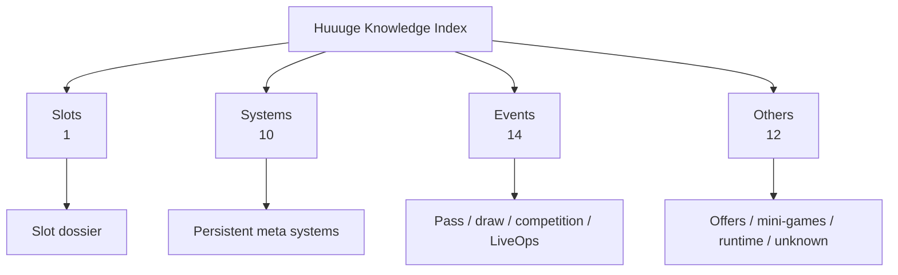

# Huuuge 研究知识索引

- 任务：TASK-0010
- 状态：TASK-0018 等待 ChatGPT Review
- 更新日期：2026-08-27
- 外部证据基线：[`huuuge-android-research@bfed5f3`](https://github.com/840832144/huuuge-android-research/commit/bfed5f30e098522ffb98ef5eb7d63e824d68b1c4)

这是整个 Huuuge Research 的统一知识导航。它把外部 module catalog 的 37 个 dossier 组织成策划可理解的四个入口，不复制源码、Raw capture、decoded values 或完整外部文档。

## 模块导航

| 分类 | 范围 | 模块数 | 证据分布 | 入口 |
| --- | --- | ---: | --- | --- |
| Slots | Slot lobby、spin、bet、win、feature、jackpot | 1 | L3 × 1 | [`SLOTS.md`](SLOTS.md) |
| Systems | 任务、VIP、Club、奖励、成长、经济、玩家/社交基础系统 | 10 | L3 × 4；L2 × 2；L1 × 4 | [`SYSTEMS.md`](SYSTEMS.md) |
| Events | Pass、抽奖、收集、竞赛、周期活动与 LiveOps | 14 | L3 × 5；L2 × 1；L1 × 8 | [`EVENTS.md`](EVENTS.md) |
| Others | 礼包/购买、小玩法、牌桌游戏、Runtime 与未分类协议 | 12 | L3 × 2；L1 × 10 | [`OTHERS.md`](OTHERS.md) |

总计：37 modules；L3 × 12、L2 × 3、L1 × 22、L0/L4 × 0。TASK-0018 只将已有 primary Runtime 闭环的 Lottery 从 L2 提升到 L3，不提升到 L4。

## Evidence Standard

所有模块统一使用 [`Huuuge Evidence Standard`](../../../standards/HUUUGE_EVIDENCE_STANDARD.md)。下表只用于导航，完整判定、引用字段和升级/降级规则以标准正文为准。

| 等级 | 导航含义 | 当前模块数 |
| --- | --- | ---: |
| L4 — Triangulated | Runtime、UI、Manual 与 Schema/Config 完成多源验证 | 0 |
| L3 — Runtime Observed | 已有可定位、可解码的 primary Runtime 证据 | 12 |
| L2 — Configured / Visible | 已有 Config 或 cross-cutting Runtime/UI，但无 primary action 闭环 | 3 |
| L1 — Schema | 有可版本化 Schema，尚无已关联运行证据 | 22 |
| L0 — Unverified | 只有未验证线索或推断 | 0 |

## 数据来源标记

- `Runtime P`：该模块 primary Runtime sample count；可支持 L3 的候选直接证据。
- `Runtime X`：cross-cutting/config Runtime sample count；没有 primary action 时最高为 L2。
- `Schema M/E`：descriptor message / service endpoint count；Schema 单独最高为 L1。
- `Schema hint ZPK`：base APK 中与模块匹配的 ZPK filename count；只作为 locator hint，不能单独升级。
- `Config`、`UI`、`Manual`：只有存在符合标准的可定位引用时才列出；当前 catalog 尚未形成统一 Citation ID，因此本次不补写不存在的引用。
- Module 名称链接到外部 commit 固定版本的 dossier；dossier 是字段、service、message 和缺口的详细入口。

## 使用方法

1. 从四个 Category 进入，不直接从 Raw capture 开始。
2. 检查 Evidence Level 与 Completion，按统一标准确认问题能否由当前证据回答。
3. 打开外部 dossier，核对 message/service/field 和 evidence limitations。
4. 当前证据不足时，只记录下一步计划；新采集或 Extractor 必须走项目 [`WORKFLOW.md`](../WORKFLOW.md)。
5. 外部仓库先更新实现和证据，AI-Workspace 只同步经 Review 的长期知识和当前状态。

## 使用边界

- 本分类是策划知识导航，不改变外部 `module_specs.json` 的 primary ownership。
- Completion 是结构目录完成度，不是模块数值研究、RTP/EV 或业务结论完成度。
- 当前 GUI 不要求手工 module/action marker；下一步计划使用正常操作、时间与 RPC 结构关联。
- TASK-0018 已用 Finalized Runtime 将 Lottery 提升到 L3；升级关联产出的因果仍是 Estimate，未提升到 L4。
