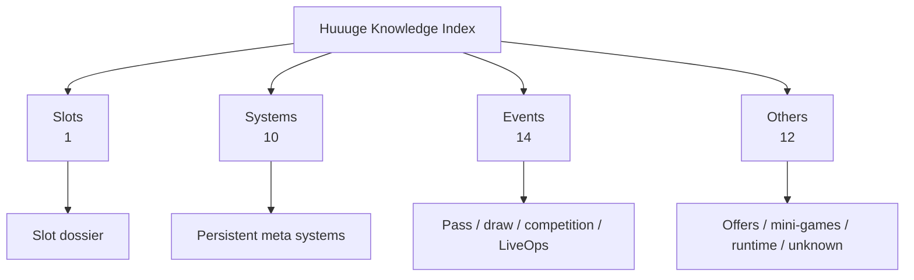

# Huuuge 研究知识索引

- 任务：TASK-0009
- 状态：等待 ChatGPT Review
- 更新日期：2026-08-26
- 外部证据基线：[`huuuge-android-research@0590c2c`](https://github.com/840832144/huuuge-android-research/commit/0590c2c37a0aa83b824920fa884f9f67007d3dcb)

这是整个 Huuuge Research 的统一知识导航。它把外部 module catalog 的 37 个 dossier 组织成策划可理解的四个入口，不复制源码、Raw capture、decoded values 或完整外部文档。

## 模块导航

| 分类 | 范围 | 模块数 | 证据分布 | 入口 |
| --- | --- | ---: | --- | --- |
| Slots | Slot lobby、spin、bet、win、feature、jackpot | 1 | E3 × 1 | [`SLOTS.md`](SLOTS.md) |
| Systems | 任务、VIP、Club、奖励、成长、经济、玩家/社交基础系统 | 10 | E3 × 4；E2 × 2；E1 × 4 | [`SYSTEMS.md`](SYSTEMS.md) |
| Events | Pass、抽奖、收集、竞赛、周期活动与 LiveOps | 14 | E3 × 4；E2 × 2；E1 × 8 | [`EVENTS.md`](EVENTS.md) |
| Others | 礼包/购买、小玩法、牌桌游戏、Runtime 与未分类协议 | 12 | E3 × 2；E1 × 10 | [`OTHERS.md`](OTHERS.md) |

总计：37 modules；E3 × 11、E2 × 4、E1 × 22，与外部 catalog 的 15 live-evidence / 22 schema-only 基线一致。

## 证据等级

| 等级 | 含义 | 可支持的结论 |
| --- | --- | --- |
| E3 — Primary live | 至少一个该模块 primary endpoint 在真实 Session 出现 | 可讨论已观察结构；完整数值和业务含义仍需字段级验证 |
| E2 — Cross-cutting/config live | 共享/config message 中出现该模块字段，但无专用 live endpoint | 可确认结构存在；不能宣称交互流程已捕获 |
| E1 — Schema-only | Descriptor/service structure 存在，当前 Session 未触发 | 只做 schema-level 导航和采集规划 |
| E0 — Inferred/static | 只有共享静态/组织性证据 | 只能保留为 Hypothesis；当前基线没有 E0 模块 |

## 数据来源标记

- `Live P`：该模块 primary live sample count。
- `Live X`：cross-cutting/config live sample count。
- `Schema M/E`：descriptor message / service endpoint count。
- `ZPK`：base APK 中与模块匹配的 ZPK filename count；只记录文件名结构，不复制 APK。
- Module 名称链接到外部 commit 固定版本的 dossier；dossier 是字段、service、message 和缺口的详细入口。

## 使用方法

1. 从四个 Category 进入，不直接从 Raw capture 开始。
2. 检查 Evidence Level 与 Completion，确认问题能否由当前证据回答。
3. 打开外部 dossier，核对 message/service/field 和 evidence limitations。
4. 当前证据不足时，只记录下一步计划；新采集或 Extractor 必须走项目 [`WORKFLOW.md`](../WORKFLOW.md)。
5. 外部仓库先更新实现和证据，AI-Workspace 只同步经 Review 的长期知识和当前状态。

## 使用边界

- 本分类是策划知识导航，不改变外部 `module_specs.json` 的 primary ownership。
- Completion 是结构目录完成度，不是模块数值研究、RTP/EV 或业务结论完成度。
- 当前 GUI 不要求手工 module/action marker；下一步计划使用正常操作、时间与 RPC 结构关联。
- TASK-0009 不开发功能、不修改采集器，所有分类等待 ChatGPT Review。
