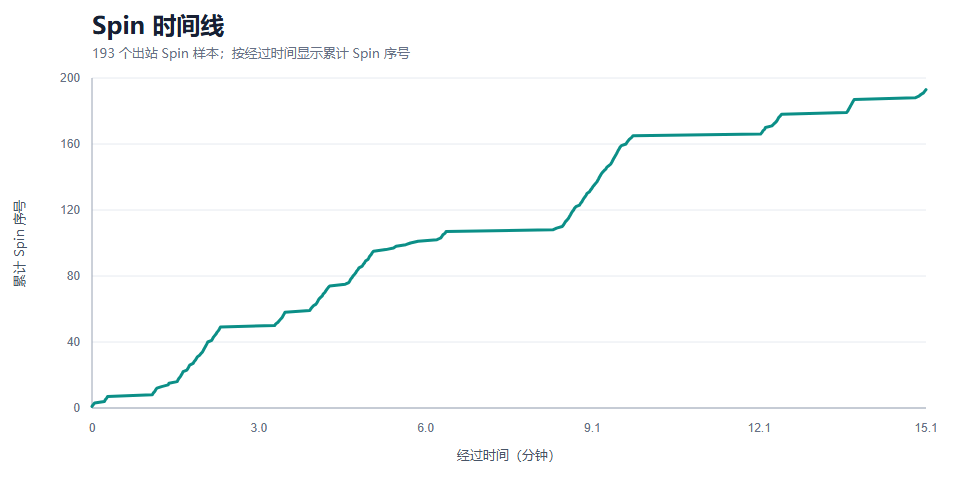
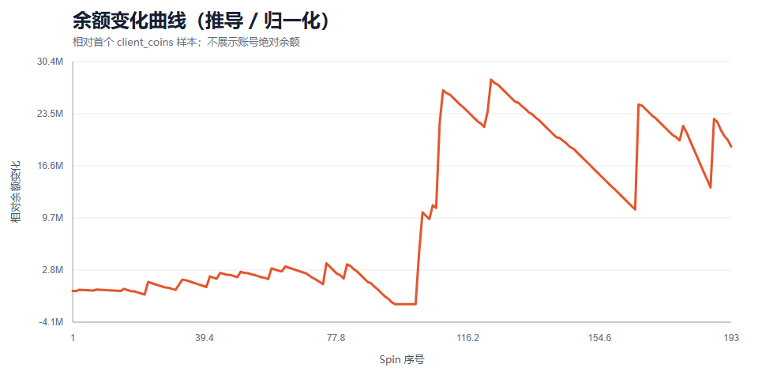
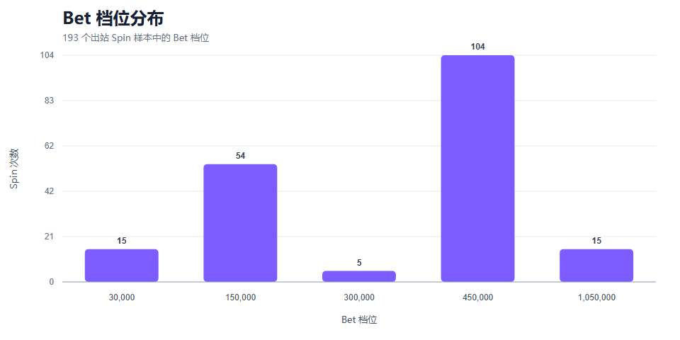

# Cash Frenzy｜老虎机体验验证（Collector Demo）

- Related Task：`TASK-0022`
- Demo date：2026-08-27
- Reader：游戏策划
- Collector level：F3 — Live structured outbound fields recovered
- Conclusion：**当前 Collector 已经能够支持基础的 Slots 体验节奏与经济波动分析，但不能替代结果解析或数值拆解。**

本 Demo 不是 RTP、EV 或概率报告。它用一次正常体验说明：在不充值、不刻意刷取、不恢复新协议的前提下，Collector 可以自动记录 Spin 节奏、Bet 选择、自动与加速状态，以及相邻 Spin 之间的余额变化，从而为策划提供可复查的体验时间线。

## 1. 实验环境

| 项目 | 本次实验 |
| --- | --- |
| 游戏 | Cash Frenzy |
| Android package | `slots.pcg.casino.games.free.android` |
| 版本 | 4.78 / versionCode 478 |
| 引擎与 ABI | Cocos2d-x + LuaJIT / arm64-v8a |
| 研究环境 | `Pie64_1 / AppResearch`；Cash Frenzy 的 Session 与其他 App 隔离 |
| 体验方式 | User 正常体验 Slots；无需刻意刷取或充值 |
| Collector Session | `20260827_192117` |
| 有效样本 | 193 个 outbound Spin；192 个闭合 Balance 转移；0 errors |
| 首末 Spin 覆盖 | 约 15.1 分钟，包含正常停顿与玩法切换时间 |

**证据规则**：Collector 直接捕获的字段与计数标为 Confirmed；由相邻 `client_coins` 计算的 Balance After、相对余额和 Net Delta 一律标为 Derived。报告不展示账号绝对余额，也不把 Win 写成 Confirmed。

> **交叉验证视频占位（User 手动拖入）**：User 提供了覆盖不完整的 `demo.MP4`。展示时可用它人工对照界面上的自动/手动状态、Bet 切换与节奏停顿。视频不是 Collector 数据源，不覆盖完整实验，也不用于证明未录制片段；当前 Agent 未读取视频内容。若飞书工具无法直接上传，请将视频手动拖到本段下方。

## 2. Collector 当前能力

当前 Collector 自动记录已经恢复的 outbound 字段，不尝试恢复 result 或其他协议层：

| 字段 | 当前用途 | 证据等级 |
| --- | --- | --- |
| `_timestamp` / capture time | 建立 Spin 时间顺序和间隔 | Confirmed |
| `spin_count` | 标记 outbound Spin 样本 | Confirmed |
| `bet` | 观察 Bet 档位选择与切换 | Confirmed |
| `lines` | 观察线路配置是否变化 | Confirmed |
| `autoSpin` | 区分自动与非自动样本 | Confirmed |
| `turbo` | 区分加速与非加速样本 | Confirmed |
| `free_spins` | 观察请求中的计数字段变化；不能单独解释 Feature 结果 | Confirmed field / Unconfirmed meaning |
| `client_coins` | 提供相邻 Spin 的 Balance Before 状态 | Confirmed field |
| Balance After / Net Delta | 由下一条 Spin 请求的 `client_coins` 闭合 | **Derived** |

这组数据已经足以回答策划体验问题：玩家在多长时间内进行了多少次 Spin、在哪些阶段停顿、主要使用哪些 Bet、自动与加速状态如何切换，以及余额波动是否呈现明显的阶跃、回撤或长段消耗。

## 3. 体验路线

Collector 没有恢复机台名称和界面路径，因此这里只描述请求字段能够直接支持的体验阶段，不虚构 UI 行为。

| 阶段 | 相对时间 | Spin 范围 | 观察到的体验状态 |
| --- | ---: | ---: | --- |
| 起步 | 0.0–4.3 分钟 | 1–74 | Bet 从 30,000 提高到 150,000，再短暂切到 300,000；以 Auto Spin + Turbo 为主，包含短段非自动样本 |
| 主体验段 | 4.6–12.5 分钟 | 75–178 | Bet 主要保持在 450,000；Auto Spin + Turbo 占主要部分，中间有少量状态切换和停顿 |
| 收尾 | 13.7–15.1 分钟 | 179–193 | Bet 切到 1,050,000；15 个样本均为非 Auto、非 Turbo |

193 个样本中，162 个记录为 `autoSpin=1 / turbo=1`，31 个记录为 `autoSpin=0 / turbo=0`。该分布可以用于解释 Spin 密度变化，但不能据此判断 User 的主观意图。

## 4. Spin Timeline

首末 Spin 相隔约 15.1 分钟。相邻样本的中位间隔为 1.33 秒，说明大部分高密度区间来自 Auto Spin + Turbo；最大间隔约 138.57 秒，对应一次明显停顿。时间线中的平台段让策划可以快速定位“持续操作”和“离开或切换”的节奏，而不需要先观看完整录屏。

## 5. Balance Timeline

本图把首个 `client_coins` 样本归一化为 0，只展示相对变化，不公开账号绝对余额。192 个相邻请求形成闭合 Balance Before / Balance After；最后一个 Spin 没有后继请求，因此保留为 open tail。

**Derived observation**：相对余额最低到达 -1,756,407，最高到达 +28,023,593，结束点为 +19,148,093；观察窗口内最大回撤为 -17,225,000。曲线出现多次明显阶跃和持续回落，说明当前 Collector 已能帮助策划定位经济体验中的“突增—消耗—再次突增”节奏。

这些数值不是 Confirmed Win，也不解释阶跃来自普通 Spin、Free Spin、Feature、奖励或其他结果。若要解释原因，需要当前范围之外的 result 或 UI 证据，本 Demo 不继续恢复。

## 6. 当前 Collector 恢复的数据

| Bet 档位 | Spin 样本 | 占比 |
| ---: | ---: | ---: |
| 30,000 | 15 | 7.8% |
| 150,000 | 54 | 28.0% |
| 300,000 | 5 | 2.6% |
| 450,000 | 104 | 53.9% |
| 1,050,000 | 15 | 7.8% |

本次 193 个样本中，`bet`、`lines`、`spin_count`、`client_coins`、`free_spins`、`autoSpin`、`turbo` 和 `_timestamp` 均达到 193/193。`lines` 始终为 40；`free_spins` 字段出现 0–5，但 Collector 没有 result 和界面语义，不能把非零值直接写成已确认的 Feature 触发或奖励结果。

相邻 Balance Transition 中，23 次为正、163 次为负、6 次为零。这些方向统计全部属于 **Derived Net Delta**，只用于描述体验波动，不代表 Win 次数、命中率或 RTP。

## 7. 当前不能恢复的数据

当前 Collector 不能可靠回答以下问题：

- 每次 Spin 的服务端 `result`、符号矩阵和中奖线；
- Confirmed Win、奖励组成、倍率和中奖动画；
- Feature、Free Spin 或 Jackpot 的触发原因、过程与结算；
- Session 最后一笔 Spin 的即时 Balance After；
- 机台正式名称、主题、弹窗、教程和其他 UI 路线；
- RTP、EV、命中率、波动率或长期概率结论。

这些限制不会阻止节奏和余额波动 Demo，但会阻止把本报告升级为数值拆解。数据不足的地方保持空白，不通过视频片段、字段名或余额阶跃反推结果。

## 8. 当前 Collector 能力总结

**策划价值已经成立**：F3 Collector 可以自动形成 Spin Timeline、Bet Distribution 和 Derived Balance Curve，帮助策划快速复盘一次正常体验中的操作密度、停顿、Bet 迁移、Auto/Turbo 使用与经济波动节奏。它比纯录屏更容易定位时间点，也比手工记录更完整。

**能力边界同样清楚**：当前结果只适合“老虎机体验验证”，不适合“数值拆解”。Win、result、Feature 和 Jackpot 均未恢复，所有 Balance After 与 Net Delta 都必须标记为 Derived。Collector 等级保持 F3，不因 Demo 升级。

**本轮结论**：停止协议恢复是合理的。现有能力已经足以制作面向策划的体验 Demo；下一步只需要由 User 在飞书中补充可选的交叉验证视频，并由 ChatGPT Review 本报告，不应在本 Task 内继续扩展 Collector。
